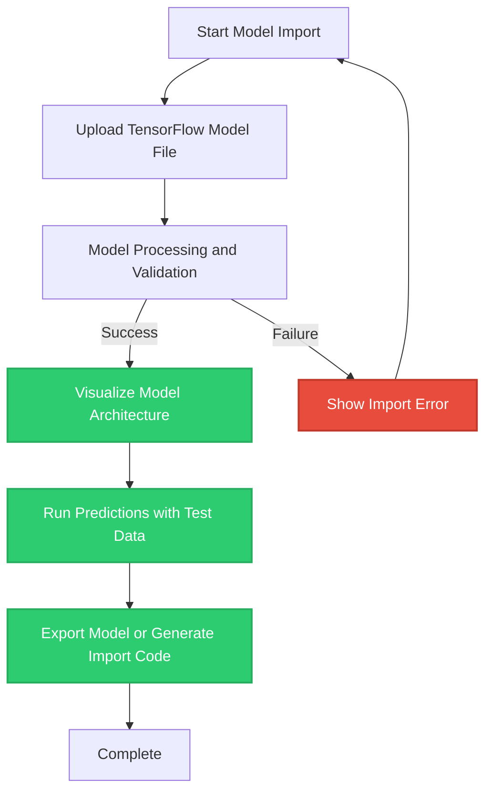

# Importing and Using Pretrained TensorFlow Models

Welcome to the guide on importing and utilizing pretrained TensorFlow models within NeuralFlow. This page empowers you to bring your existing TensorFlow models or popular open-source models into NeuralFlow's intuitive no-code environment. You’ll be able to upload models, visualize their architecture, run predictions, and export results—all without writing a single line of code.

---

## 1. Workflow Overview

### What This Guide Helps You Accomplish
Import pretrained TensorFlow models into NeuralFlow for visualization, experimentation, and deployment. Leverage your existing models or community-shared architectures seamlessly within NeuralFlow's no-code interface.

### Prerequisites
- A pretrained TensorFlow model file (commonly `.h5` or SavedModel format).
- NeuralFlow platform access with your account set up.
- Basic familiarity with machine learning model concepts.

### Expected Outcome
- Successfully upload a TensorFlow model to NeuralFlow.
- Visualize the model's architecture visually in the builder.
- Execute predictions using your imported model.
- Export results or download the model in supported formats.

### Time Estimate
Approximately 15-30 minutes depending on model size and complexity.

### Difficulty Level
Beginner to Intermediate

---

## 2. Step-by-Step Instructions

### Step 1: Access the Model Importer
1. Log into NeuralFlow and navigate to the **Model Import** section via the main menu or dashboard.
2. Click on the **Upload TensorFlow Model** button.

### Step 2: Upload Your TensorFlow Model
1. Choose your TensorFlow model file (`.h5` or SavedModel directory) from your local machine.
2. Confirm the file selection to initiate the upload.
3. Wait for the upload and processing to complete; a success notification will confirm import.

> **Tip:** Large models may take longer to upload and process. Ensure a stable internet connection.

### Step 3: Visualize the Imported Model Architecture
1. Once uploaded, open the imported model in the NeuralFlow **Model Builder** interface.
2. Observe the node-based visual representation of your model’s layers and connections.
3. Use zoom and pan controls to explore complex architectures.

> **Best Practice:** Review the imported structure to verify all layers have been mapped correctly.

### Step 4: Run Predictions with Your Imported Model
1. Prepare or upload test input data within the platform.
2. Use the **Run Prediction** feature to execute inference with your imported model.
3. Review the prediction output displayed in the NeuralFlow UI.

### Step 5: Export or Download Your Model
1. After evaluation or further editing, access the **Export** option.
2. Choose your preferred export format:
   - **TensorFlow-supported formats** to download locally.
   - **Direct integration import code snippet** to embed the model in your Python environment instantly.
3. Save or copy the export as needed.

> Example Python code snippet generated by NeuralFlow:

```python
import neuralflow as nf

NEURAL_FLOW_API_KEY="your_api_key_here"

model = nf.getModel(
    id="your_model_id_here",
    api_key=NEURAL_FLOW_API_KEY
)
```

This snippet lets you directly import the model into your Python environment without downloading the file multiple times.

---

## 3. Real-World Example

Imagine you have a pretrained UNet model in TensorFlow for image segmentation:

### a) Uploading the Model
Select your UNet `.h5` file and upload it via the importer.

### b) Visualizing Architecture
You’ll see layers such as `Conv2D`, `MaxPooling2D`, and `UpSampling2D` nodes mapped visually, exactly as in TensorFlow:

```python
# unet
conv1 = Conv2D(4, (3, 3), activation='relu', padding='same')(input_img)
conv1 = Conv2D(4, (3, 3), activation='relu', padding='same')(conv1)
pool1 = MaxPooling2D(pool_size=(2, 2))(conv1)

conv2 = Conv2D(8, (3, 3), activation='relu', padding='same')(pool1)
conv2 = Conv2D(8, (3, 3), activation='relu', padding='same')(conv2)
pool2 = MaxPooling2D(pool_size=(2, 2))(conv2)

conv3 = Conv2D(16, (3, 3), activation='relu', padding='same')(pool2)
conv3 = Conv2D(16, (3, 3), activation='relu', padding='same')(conv3)

# Decoding path
up1 = UpSampling2D((2, 2))(conv3)
concat1 = Concatenate()([up1, conv2])
conv4 = Conv2D(8, (3, 3), activation='relu', padding='same')(concat1)
conv4 = Conv2D(8, (3, 3), activation='relu', padding='same')(conv4)
```

### c) Running Predictions
Upload test images and run inference using the imported model, viewing output masks live.

### d) Exporting Results
Download the edited model or grab a Python snippet to call it via NeuralFlow’s API.

---

## 4. Troubleshooting

<AccordionGroup title="Common Issues and Solutions">
<Accordion title="Upload Fails or Times Out">
- Check your internet connection.
- Verify model file is not corrupted and is the correct TensorFlow format.
- Try splitting large models if supported by NeuralFlow or reducing size.
</Accordion>
<Accordion title="Model Visualization Is Incomplete">
- Confirm the uploaded model is fully saved in TensorFlow format.
- Complex custom layers might not map perfectly; consider simplifying layers or recreating in NeuralFlow.
</Accordion>
<Accordion title="Prediction Output Is Unexpected">
- Ensure test data matches the model’s expected input shape and type.
- Check if preprocessing was required when training the model (e.g., normalization).
- Use NeuralFlow’s debugging tools to inspect intermediate layer outputs.
</Accordion>
<Accordion title="Exported Model Does Not Import"
>
- Confirm you are using the latest NeuralFlow SDK.
- Check API key and Model ID correctness.
- Validate export format compatibility with your environment.
</Accordion>
</AccordionGroup>

---

## 5. Best Practices & Tips

- Make sure your TensorFlow models are saved in a compatible and standard format (`.h5` or SavedModel).
- Before import, test your model locally in TensorFlow to avoid shape or compatibility issues.
- Use NeuralFlow’s visualization to understand complex architectures and identify layer mismatches.
- Take advantage of the generated Python import snippet for smooth integration into your development workflow.
- Leverage test data prediction to validate model behavior before full deployment.

---

## 6. Next Steps & Related Content

- After import, use the **Build Your First Model (No Code)** guide to learn how to construct models directly within NeuralFlow.
- Explore **Integration with Other Systems** for connecting your imported models to GitHub or APIs.
- Review **Optimizing Model Performance and Workflow** to enhance your imported models further.
- Check out **Troubleshooting Common Issues** if you face problems during model import or use.

---

NeuralFlow makes running your TensorFlow models effortless and accessible, unlocking powerful no-code ML workflows with your pretrained assets.

---

## Visual Overview of Import Workflow



---