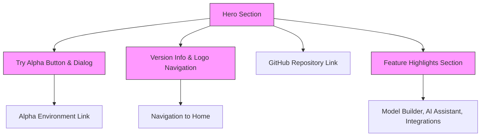

# Setting Up and Exploring the NeuralFlow Platform

Welcome to the NeuralFlow platform walkthrough. This guide will help you set up the environment for NeuralFlow—either locally or in the cloud—launch the application, and get familiar with the key areas within the platform. By following these practical, step-by-step instructions, you will confidently navigate and start using NeuralFlow to build, integrate, and train machine learning models without writing code.

---

## 1. Workflow Overview

### What You Will Accomplish
This guide enables you to:
- Install NeuralFlow on your local machine or access it in an alpha environment
- Launch and verify the application is running correctly
- Understand the main pages and UI components you will work with
- Get familiar with navigation, versioning info, and key actions available on the home screen

### Prerequisites
Before starting, ensure you have:
- Node.js installed (refer to our [Prerequisites & System Requirements](https://yourdocslink/getting-started/setup-and-installation/prerequisites))
- A stable internet connection if accessing alpha externally
- Basic familiarity with web apps and browser navigation

### Expected Outcome
After completing this guide, you will:
- Successfully run NeuralFlow locally or access the alpha version
- Identify key UI sections such as the Hero section, feature highlights, and integration info
- Understand how to access version information and open alpha features

### Time Estimate
About 10-15 minutes for local setup and initial exploration, or less if simply accessing the alpha environment online.

### Difficulty Level
Beginner – this guide is designed for first-time users to get setup and oriented.

---

## 2. Step-by-Step Instructions

<Steps>
<Step title="Install NeuralFlow Locally or Access Alpha">
1. To install locally, clone the repository and install dependencies via npm/yarn/pnpm. Follow the detailed steps in our [Installation Guide](https://yourdocslink/getting-started/setup-and-installation/installation).
2. Alternatively, if you want to try the alpha version immediately, use the ‘Try Alpha’ button on the home page to open the alpha environment in a new tab.

<Check>
Ensure Node.js version meets requirements and dependencies install without errors.
</Check>
</Step>

<Step title="Start the Development Server">
1. In your terminal, run `npm run dev` (or equivalent) to start the local Next.js development server.
2. Wait for the server log confirming it's running on `http://localhost:3000`.

<Check>
Visit `http://localhost:3000` in your browser and verify the NeuralFlow home page loads.
</Check>
</Step>

<Step title="Explore the Hero Section">
1. At the top of the home page, observe the Hero section featuring a large headline: “Build, Integrate, Train.”
2. Note the descriptive subtitle: _A no code platform to build, integrate and train your machine learning models._
3. Locate and click the ‘Try Alpha’ button to launch the experimental environment for proof of concept.

<Check>
The button opens a dialog explaining alpha limitations and provides a link to the alpha platform.
</Check>
</Step>

<Step title="Navigate through the Home Page Sections">
1. Scroll down to view the visual feature highlights, demo animations, and integration sections.
2. Each section presents key platform capabilities like model building, integrations, and AI assistant support.
3. Familiarize yourself with these areas as they represent primary workflows you will engage with.

<Check>
You can visually identify the sections titled Features, Animated Demo, Bonny (AI assistant), and Integration.
</Check>
</Step>

<Step title="Verify Version Info and Header Navigation">
1. On the top-left corner, find the NeuralFlow logo with the current version badge (v0.1.2 Beta).
2. Click the logo to always return to the home page.
3. On the right side of the header, access the GitHub link to view the source repository.

<Check>
Confirmed version info and navigation links function as expected.
</Check>
</Step>
</Steps>

---

## 3. Understanding the Main UI Components on the Home Page

### Hero Section
- **Purpose:** Quickly communicate NeuralFlow’s mission and core capabilities.
- **Key Elements:** Bold headline, descriptive subtitle, and a clear call-to-action button to try the alpha version.

### Try Alpha Button & Dialog
- Opens a dialog warning users about potential instability since alpha is intended for proof of concept.
- Provides a direct link to the alpha environment for experimentation.

### Navigation Bar
- Features the NeuralFlow logo and program version visibly.
- Provides quick access to the open source repository on GitHub.

### Feature and Integration Sections (Below Hero)
- Highlight key platform capabilities like the no-code builder, integrations, and AI assistant Bonny.
- Contain graphical elements and descriptive text, guiding users on what to explore next.

---

## 4. Practical Tips and Best Practices

- **For Local Setup:** Run your server in a separate terminal window and leave it running to test code changes live.
- **Using Alpha:** Treat the alpha environment as experimental; save work frequently and report bugs.
- **Navigation:** Always return to the home page via the header logo for quick orientation.
- **Explore Incrementally:** Start with the Hero and Feature sections before moving into model building workflows.

---

## 5. Common Issues & Troubleshooting

<AccordionGroup title="Common Issues During Setup and Exploration">
<Accordion title="Cannot access http://localhost:3000">
- Check if the development server started without errors.
- Confirm you used the right command: `npm run dev` or similar.
- Ensure no firewall or port conflicts block port 3000.
</Accordion>
<Accordion title="'Try Alpha' Button Does Not Open Dialog">
- Verify that JavaScript is enabled in your browser.
- Make sure pop-ups are not blocked.
- Try refreshing the page and clicking again.
</Accordion>
<Accordion title="UI Elements Not Styled Correctly">
- Confirm Tailwind CSS is properly installed and builds without errors.
- Clear browser cache and reload.
</Accordion>
<Accordion title="Version Number Not Displayed or Outdated">
- This number is set in source and reflects current build; rebuild the app if it seems stale.
</Accordion>
</AccordionGroup>

---

## 6. Next Steps & Related Content

- After setup and exploration, proceed to [Build Your First Model (No Code)](https://yourdocslink/guides/core-workflows/first-model) to start creating machine learning models visually.
- Review [Prerequisites & System Requirements](https://yourdocslink/getting-started/setup-and-installation/prerequisites) if you encounter setup issues.
- Explore the [Quick Feature Overview](https://yourdocslink/overview/features-integration/feature-snapshot) to understand more platform capabilities.
- Join the community and track alpha issues via the GitHub repository linked in the header.

---

We are excited to have you begin your NeuralFlow journey. This no-code platform is designed to empower your machine learning experimentation and development with intuitive visual tools and seamless integrations. Start exploring now and unlock your model's potential!

---

## Appendix: Example Commands for Local Setup

```bash
# Clone the repository
 git clone https://github.com/thedevflex/neuralflow.git

# Enter the project directory
 cd neuralflow

# Install dependencies
 npm install

# Start the development server
 npm run dev
```

Open your browser and navigate to `http://localhost:3000` to access NeuralFlow locally.

---

## Visual Overview of Home Page Components



This diagram demonstrates the main interactive and informative elements the user encounters on the NeuralFlow homepage.

---

For full details on prerequisites, installation, and troubleshooting, please visit the related guides linked above.