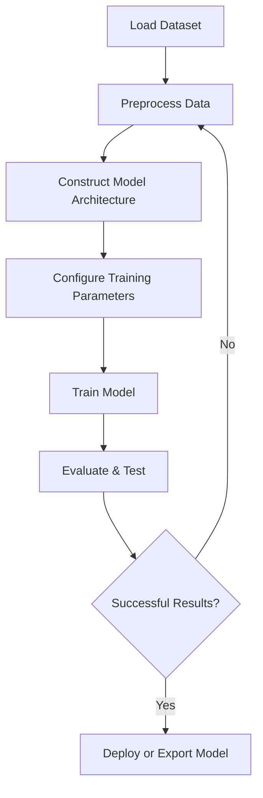

# Common Machine Learning Scenarios (Classification & Regression)

This guide shows you how to construct and experiment with common machine learning tasks—specifically image classification and numeric regression—using NeuralFlow. Through step-by-step examples and sample datasets, you'll see how NeuralFlow's no-code building blocks translate into real-world problem-solving pipelines.

---

## 1. Workflow Overview

### What You Will Achieve
- Build and train two typical ML models: a classification model for images and a regression model for numeric data.
- Understand how to arrange NeuralFlow nodes and configure parameters for different tasks.
- Experiment with sample datasets, interpreting outputs.

### Prerequisites
- NeuralFlow installed and running (see [Installation Guide](../../getting-started/setup-and-installation/installation)).
- Basic familiarity with the NeuralFlow interface and its visual model builder. If new, review [Build Your First Model (No Code)](../core-workflows/first-model).
- Sample datasets loaded or accessible (included in examples).

### Expected Outcome
- Successfully build, train, and evaluate a simple image classification pipeline.
- Construct a numeric regression model predicting continuous values.
- Gain confidence to extend these workflows to your own datasets.

### Estimated Time
Approximately 30–45 minutes.

### Difficulty Level
Beginner to Intermediate — no programming required but some understanding of ML concepts is helpful.

---

## 2. Step-by-Step Instructions

### Scenario 1: Image Classification

Build an image classification pipeline to categorize images into predefined classes.

<Steps>
<Step title="Load Sample Dataset">
Access the sample image dataset bundled with NeuralFlow. Navigate to the dataset manager panel, select the "Image Classification Sample" dataset, and import it.

**Expected Result:** Dataset is visible in the Data panel with image previews and labels.
</Step>
<Step title="Add Input Node and Data Source">
Drag an "Input" node onto the canvas and connect it to your dataset source node.

**Expected Result:** The input node receives batches of images with corresponding labels.
</Step>
<Step title="Add Preprocessing Nodes">
Insert nodes for image resizing and normalization:
- Add a "Resize" node and set resolution (e.g., 128x128).
- Chain a "Normalize" node to standardize pixel values.

**Expected Result:** Images are uniformly sized and scaled between 0 and 1.
</Step>
<Step title="Construct Neural Network Layers">
Build your neural network:
- Add Conv2D layers with ReLU activation.
- Add MaxPooling layers for downsampling.
- Use Flatten followed by Dense layers culminating with a Softmax output for classification.

**Expected Result:** A visual network representing convolutional architecture is formed.
</Step>
<Step title="Configure Training Parameters">
Set the training parameters:
- Choose optimizer (e.g., Adam).
- Set loss function to categorical crossentropy.
- Define batch size and epochs.

**Expected Result:** Training node is configured to start training upon execution.
</Step>
<Step title="Train the Model">
Run the training process and monitor progress.

**Expected Result:** Training loss and accuracy metrics display and improve over epochs.
</Step>
<Step title="Evaluate and Test">
Use test images to run inference and observe predictions.

**Expected Result:** Model outputs category labels with confidence scores matching expected classes.
</Step>
</Steps>

### Scenario 2: Numeric Regression

Create a model to predict continuous numerical values (e.g., house price estimation).

<Steps>
<Step title="Load the Regression Dataset">
Import a numeric dataset containing features and target values.

**Expected Result:** Dataset imported and visible in the Data panel.
</Step>
<Step title="Set Up Input and Data Processing Nodes">
Connect inputs from the dataset, apply normalization or standard scaling nodes.

**Expected Result:** Data is preprocessed for better training performance.
</Step>
<Step title="Build the Regression Neural Network">
Stack fully connected (Dense) layers with ReLU activations.
End with a single-unit output layer with linear activation for continuous value prediction.

**Expected Result:** Model visually represents a multilayer perceptron.
</Step>
<Step title="Configure Training Settings">
Choose the optimizer (Adam or RMSProp), set mean squared error (MSE) as the loss function, and specify training hyperparameters.

**Expected Result:** Training node ready for execution.
</Step>
<Step title="Train the Model">
Start training and observe the decrease in loss.

**Expected Result:** Training loss decreases steadily and model converges.
</Step>
<Step title="Run Predictions and Interpret Results">
Input new data samples and observe predicted numeric outputs.

**Expected Result:** Predictions align closely with expected target ranges.
</Step>
</Steps>

---

## 3. Examples & Code Samples

NeuralFlow’s visual environment generates code snippets for direct use in Python environments.

### Classification Model Snippet
```python
# Example Convolutional Layers
conv1 = Conv2D(32, (3, 3), activation='relu', padding='same')(input_img)
pool1 = MaxPooling2D(pool_size=(2, 2))(conv1)
conv2 = Conv2D(64, (3, 3), activation='relu', padding='same')(pool1)
pool2 = MaxPooling2D(pool_size=(2, 2))(conv2)
flat = Flatten()(pool2)
dense1 = Dense(128, activation='relu')(flat)
output = Dense(num_classes, activation='softmax')(dense1)
```

### Regression Model Snippet
```python
# Example Fully Connected Network
input_layer = Input(shape=(num_features,))
dense1 = Dense(64, activation='relu')(input_layer)
dense2 = Dense(32, activation='relu')(dense1)
output = Dense(1, activation='linear')(dense2)
```

### Importing Model via NeuralFlow API
```python
import neuralflow as nf

NEURAL_FLOW_API_KEY="xxxxxxxxxxxxxxxxxxxx"

model = nf.getModel(
    id="xxxx-xxxx-xxxx",
    api_key=NEURAL_FLOW_API_KEY
)
```
Use this generated code to run or extend your model outside of NeuralFlow.

---

## 4. Troubleshooting & Tips

### Common Issues
- **Training stalls or loss not decreasing:** Check dataset quality and preprocessing nodes. Ensure labels are correctly formatted.
- **Model architecture errors:** Verify node connections and matching input/output dimensions.
- **Dataset loading fails:** Confirm dataset paths and format compatibility.

### Best Practices
- Normalize or standardize numeric inputs to improve training stability.
- Use small batch sizes during initial experiments to diagnose issues quickly.
- Visualize training metrics often to catch overfitting early.
- Start with simple models before increasing complexity.

### Performance Considerations
- For large image datasets, reduce input size to balance accuracy and training speed.
- Use appropriate hardware acceleration if available.

### Alternative Approaches
- Explore different optimizers (SGD, RMSProp) depending on model behavior.
- Use transfer learning with pretrained models for complex image classification if supported.

---

## 5. Next Steps & Related Content

- After mastering these scenarios, explore [Importing and Using Pretrained TensorFlow Models](/guides/core-workflows/import-model) to leverage existing models.
- Learn about integrations with GitHub and APIs in [Integration with External Tools](/guides/use-cases-integration/integration-examples).
- Deepen knowledge in [Optimizing Model Performance and Workflow](/guides/use-cases-integration/advanced-tips).

---

## Visual Summary of Workflow


---

This guided workflow transforms abstract ML concepts into concrete practices inside NeuralFlow's intuitive no-code environment, enabling efficient building, training, and testing of classification and regression models.


