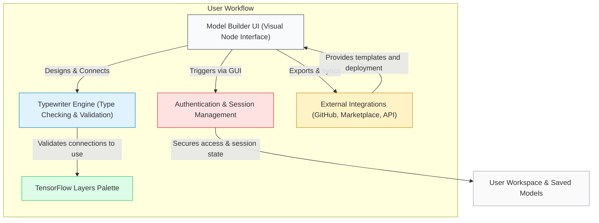

# Core Concepts & Terminology

Welcome to the foundational guide that orients you to the essential concepts behind NeuralFlow. This page explains the core terminology and pivotal components you will interact with throughout your model building journey. Understanding these concepts ensures you confidently navigate the platform and leverage its full potential.

---

## Why This Matters

NeuralFlow redefines machine learning by making it accessible through a visual, no-code environment. However, success depends on your familiarity with the platform’s key concepts — from the no-code Model Builder and TensorFlow layers to the behind-the-scenes Typewriter Engine and Authentication system. This page maps these concepts directly to your practical workflows.

By mastering these ideas, you can:
- Visualize how your actions in the UI translate into model logic
- Understand data and type constraints imposed automatically
- Know how integration and sessions keep your work seamless and secure

---

## Essential Concepts Explained

### 1. Model Builder
- **What it is:** The heart of NeuralFlow's no-code experience.
- **Purpose:** Design complex neural networks visually by dragging and connecting nodes that represent layers and operations.
- **User Workflow:** Select layers like convolution or dense units, configure their parameters, and chain them to create powerful models without writing a single line of code.
- **Why it matters:** It eliminates coding barriers, empowering users ranging from beginners to experts to prototype, iterate, and deploy ML solutions rapidly.

### 2. No-Code Workflow
- **What it is:** The guided, visual process of building, training, and deploying ML models without programming.
- **Purpose:** Simplify every step so users focus on outcomes instead of technical complexity.
- **User Workflow:** Start by choosing pre-built layers or templates, configure settings through intuitive dialogs, validate your model, and then launch training—all in an accessible interface.
- **Why it matters:** This democratizes AI, fast-tracking experimentation and application for data enthusiasts and business users alike.

### 3. Typewriter Engine
- **What it is:** The intelligent system powering type handling and validation behind the scenes.
- **Purpose:** Automatically enforce correct data types and layer compatibility as you connect nodes, preventing common modeling errors.
- **User Workflow:** When you connect layers, Typewriter Engine checks input/output data shapes and types, ensuring every connection is valid before training.
- **Why it matters:** It provides real-time feedback on possible type errors, helping maintain model integrity without requiring manual debugging.

### 4. TensorFlow Layers
- **What it is:** The building blocks representing standard ML operations like convolution, pooling, and dense layers.
- **Purpose:** Provide robust, industry-standard components users can easily combine.
- **User Workflow:** Choose layers from a palette, set parameters (e.g., number of filters, kernel size), and connect them to define your model architecture visually.
- **Why it matters:** This offers flexibility and power, enabling models comparable to those built via code but without technical overhead.

### 5. Authentication and Session Management
- **What it is:** The security and user management system managing access to your workspace.
- **Purpose:** Safeguard your models and data with secure sign-in, session persistence, and role-based access.
- **User Workflow:** Log in to your account to save progress, track projects, and securely access integrations.
- **Why it matters:** It ensures your work is protected and enables features like collaboration and cloud-based training.

### 6. Integrations
- **What it is:** Connectors linking NeuralFlow to external services like GitHub, Model Marketplace, and API deployment systems.
- **Purpose:** Enhance your workflow by enabling version control, reuse of shared models, and seamless production deployment.
- **User Workflow:** Sync your projects with GitHub repositories for versioning, browse templates or community models in the marketplace, and generate API keys to embed your trained models in applications.
- **Why it matters:** These integrations extend NeuralFlow from a visual design tool into a fully operational ML lifecycle platform.

---

## How These Concepts Fit Together in Your Workflow

This diagram illustrates how these fundamental elements interplay to create a smooth user experience from initial design to deployment.

---

## Practical Tips for Success

- **Start with Pre-built Layers:** Leverage TensorFlow layers presets to accelerate your model setup.
- **Watch for Validation Warnings:** Use Typewriter Engine’s real-time feedback to avoid incompatible connections early.
- **Keep Your Session Active:** Ensure stable authentication sessions to prevent data loss and enable seamless integrations.
- **Explore Integrations Early:** Connect GitHub and the Model Marketplace upfront to maximize collaboration and reuse.

---

## Common Pitfalls & Troubleshooting

<AccordionGroup title="Common Challenges & How To Avoid Them">
<Accordion title="Layer Connection Errors">
Connecting incompatible layers may block model training. Check the Typewriter Engine’s messages closely and adjust layer parameters or sequence accordingly.
</Accordion>
<Accordion title="Session Timeout or Authentication Issues">
If you get logged out unexpectedly, refresh your browser or re-login. Ensure your internet connection is stable and that two-factor authentication (if enabled) is completed.
</Accordion>
<Accordion title="Integration Sync Failures">
Make sure your GitHub tokens or API keys are current and permissions are granted. Review integration logs for detailed errors.
</Accordion>
</AccordionGroup>

---

## Next Steps

Having a solid grasp of these core concepts equips you to move confidently into hands-on model building. We recommend proceeding to the [Build Your First Model (No Code)](/guides/core-workflows/first-model) guide for a step-by-step walkthrough.

If you'd like a broader overview of NeuralFlow’s purpose and value, visit [What is NeuralFlow?](/overview/product-intro/what-is-neuralflow) or explore [Product Architecture](/overview/architecture-concepts/product-architecture) for a visual understanding of system components.

---

## Summary
By grounding yourself in these foundational ideas—Model Builder, No-Code Workflow, Typewriter Engine, TensorFlow layers, Authentication, and Integrations—you unlock the full power of NeuralFlow. These building blocks let you focus on crafting impactful machine learning models with confidence and ease.

---

## References & Related Links
- [What is NeuralFlow?](/overview/product-intro/what-is-neuralflow)
- [Core Value Proposition](/overview/product-intro/value-proposition)
- [Product Architecture](/overview/architecture-concepts/product-architecture)
- [Build Your First Model (No Code)](/guides/core-workflows/first-model)
- [Integration Overview](/overview/features-integration/integrations-overview)

---

If you encounter any uncertainties, refer back to this foundational page to clarify terminology and workflow context.

Your journey to building and deploying machine learning models starts here with clarity and purpose.