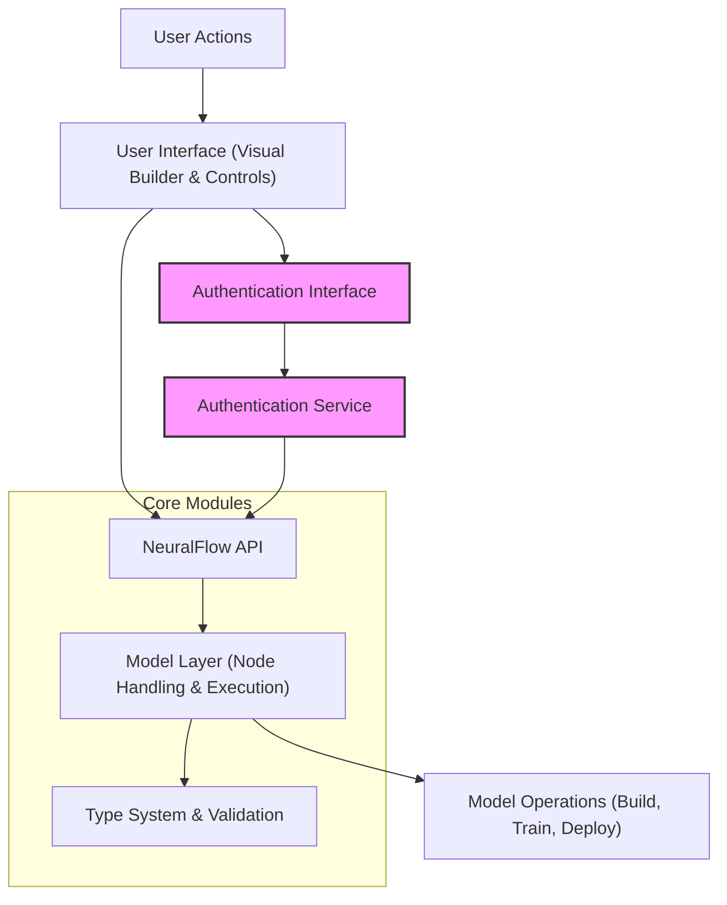

# Product Architecture

## Visualizing NeuralFlow's Core Structure

Understanding the architecture behind NeuralFlow reveals how user interactions flow seamlessly from the intuitive UI all the way through to model operations and deployments. This page offers a clear, visual overview of the platform's modular components and how they connect, highlighting key integration points such as type handling, API communication, authentication, and the model layers.

By seeing this architecture, you grasp how NeuralFlow safely manages complexity while delivering a no-code experience that scales from prototyping to production deployment.

---

## Why This Architecture Matters to You

Whether you're designing models, integrating workflows, or coordinating teams, knowing how NeuralFlow's components interrelate empowers you to:

- Efficiently navigate each interaction stage: from visual model building to API calls and final training.
- Understand where authentication ensures secure data flow.
- Identify the modular design that simplifies maintenance and extensibility.
- Recognize integration points like the type system that guarantee model consistency.

This clarity reduces friction and lets you focus on accelerating your machine learning goals.

---

## NeuralFlow Architecture Diagram

---

## Detailed Component Overview

### User Interface (UI)
- **Purpose:** The intuitive visual builder where you design and manipulate neural network models without writing code.
- **Why it matters:** It translates complex ML concepts into approachable node-based workflows, lowering entry barriers.

### Authentication Interface & Service
- **Purpose:** Manage user identity, session security, and permissions.
- **Why it matters:** Ensures that your model data, configurations, and deployments are securely accessed and authorized.

### NeuralFlow API
- **Purpose:** Acts as the communication gateway between the UI and core services.
- **Why it matters:** Enables smooth, stateless interactions to fetch, update, and trigger model processes.

### Model Layer (Node Handling & Execution)
- **Purpose:** Implements model construction, manipulation, training initiation, and output management.
- **Why it matters:** This is the engine powering your no-code model workflows with flexibility and reliability.

### Type System & Validation
- **Purpose:** Ensures data passed through nodes and APIs are consistent and valid.
- **Why it matters:** Maintains model integrity and prevents runtime errors through explicit type checks.

### Data Flow
- **User Actions → UI → API → Model Layer → Type System → Model Operations**
- This flow guarantees that every user input is validated, securely processed, and accurately reflected in model states and outputs.

---

## Real-World Scenario: Building and Training a Model
1. **You initiate a model design by adding layers and connecting nodes visually in the UI.**
2. **Each interaction calls API endpoints that relay your configuration to the Model Layer.**
3. **The Model Layer consults the Type System to verify data compatibility and configuration correctness.**
4. **Authenticated via the Authentication Service, your saved model triggers the training operation.**
5. **Progress and results flow back through the API to update your interface in real-time.**

This behind-the-scenes choreography lets you focus purely on model innovation rather than technical plumbing.

---

## Practical Tips & Best Practices
- **Leverage Authentication Early:** Use the secure login to safeguard your models and projects.
- **Respect Type System Feedback:** Pay close attention to validation messages to avoid configuration errors.
- **Explore Modular Components:** Understanding the architecture helps when troubleshooting or customizing workflows.

---

## Troubleshooting Common Issues
<AccordionGroup title="Troubleshooting Common Architecture Issues">
<Accordion title="API Communication Failures">
- Ensure your authentication tokens are valid and refreshed.
- Confirm API endpoints are reachable and correct.
- Check network connectivity and CORS policies if accessing from the UI.
</Accordion>
<Accordion title="Model Validation Errors">
- Review node connections for data type mismatches.
- Check for missing required parameters in node configurations.
- Refer to validation messages surfaced in the UI for guidance.
</Accordion>
<Accordion title="Authentication Problems">
- Verify your login credentials.
- Ensure cookies or session tokens are not blocked by your browser.
- Confirm your user role has sufficient permissions.
</Accordion>
</AccordionGroup>

---

## Next Steps
To deepen your understanding and start harnessing NeuralFlow's power:

- Visit the [What is NeuralFlow?](./what-is-neuralflow) page for a full product intro.
- Explore [Core Concepts & Terminology](./core-concepts) to grasp foundational ideas.
- Move to [Quick Feature Overview](./feature-snapshot) to see features in action.

With this architectural foundation, you’ll navigate NeuralFlow with confidence and efficiency.

---

## Additional Resources
- [GitHub Repository](https://github.com/thedevflex/neuralflow) — Explore source code and contribute.
- [Integration Overview](./integrations-overview) — Understand how to connect NeuralFlow with your ecosystem.

---

By visualizing NeuralFlow’s architecture, you gain transparency into its design philosophy and operational flow, empowering you to use the platform more effectively and troubleshoot with insight.

---

*End of Product Architecture Documentation.*