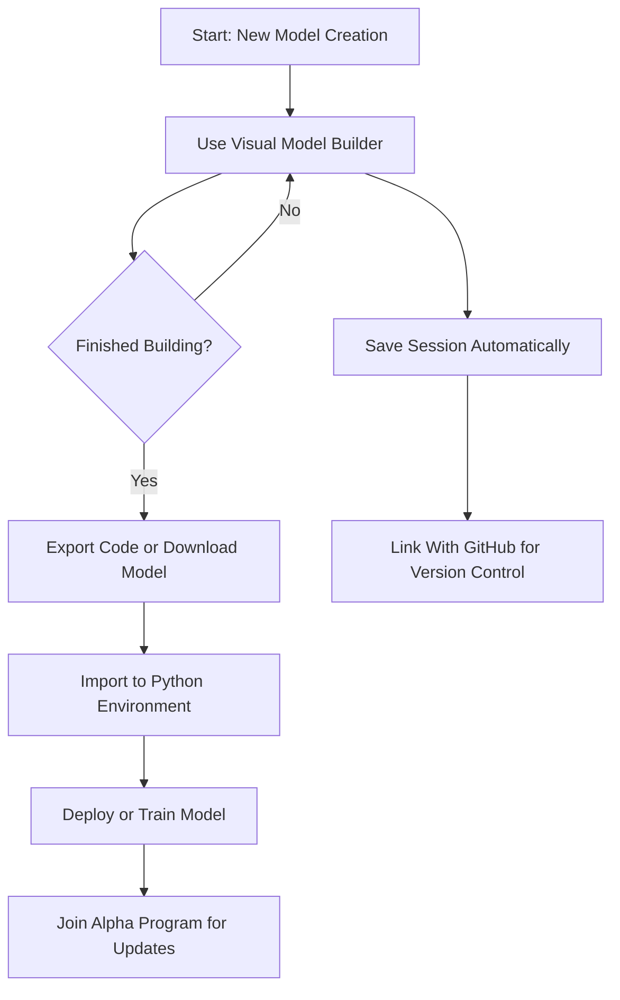

# Quick Feature Overview

Welcome to the Quick Feature Overview of NeuralFlow—a no-code machine learning platform designed to put the power of neural network creation in your hands with simplicity and efficiency. This guide highlights the core capabilities of the platform, helping you quickly find and experiment with key features that accelerate your machine learning workflows.

---

## Visual Model Builder

At the heart of NeuralFlow lies an intuitive visual model builder that transforms complex model design into a straightforward click-and-connect experience. Whether you're a beginner or a seasoned pro, you can build neural networks visually without writing a single line of code.

- **Drag and drop layers**: Choose from various layer types like convolutional, pooling, and dense layers.
- **Connect with ease**: Link layers simply by clicking on nodes to define model structure.
- **Instant tweakability**: Modify parameters on the fly to experiment with architectures rapidly.

> _Example_: Want to build a UNet for image segmentation? Just pick convolutional and upsampling layers, connect them visually, and adjust activations—all from the UI. 

<Info>
The visual builder accelerates experimentation by removing code syntax barriers, letting you focus purely on model ideas and architecture.
</Info>


## Seamless Import and Export Flows

NeuralFlow supports effortless model import and export mechanisms to blend smoothly with your existing workflows.

- **Import pretrained TensorFlow models**: Bring in models directly without manual conversions.
- **Export models as TensorFlow code snippets**: Copy the generated Python code instantly for use in your projects.
- **Direct API package import**: Use the NeuralFlow Python package to load models via unique IDs and API keys.
- **Download in supported formats**: Export your model in TensorFlow-compatible formats for offline use or deployment.

### Code Example: Import Model with NeuralFlow Python Package
```python
import neuralflow as nf

NEURAL_FLOW_API_KEY = "xxxxxxxxxxxxxxxxxxxx"

model = nf.getModel(
    id="xxxx-xxxx-xxxx",
    api_key=NEURAL_FLOW_API_KEY
)
```

<Tip>
Copy-pasting generated TensorFlow code or using the API import lets you integrate NeuralFlow models seamlessly into your Python environments, enhancing productivity and flexibility.
</Tip>

## Session Management & Workflow Continuity

NeuralFlow ensures your work stays safe and accessible throughout your model-building journey.

- **Persistent sessions**: Automatically save your progress to avoid losing model configurations.
- **Version control integration**: Connect your GitHub account to synchronize and manage model versions for collaborative development.
- **Safe experimentation**: Roll back to previous model versions or configuration states with ease.

<Check>
Utilizing session management and GitHub integration helps reduce risks and enhances collaborative workflows.
</Check>

## Exclusive Alpha Program Access

Gain early access to cutting-edge features and updates through NeuralFlow's Alpha Program.

- **Early feature trials**: Experience new capabilities before public releases.
- **Direct feedback channel**: Influence product development with your insights.
- **Community engagement**: Join discussions and collaborate with fellow testers.

<Note>
Participation in the Alpha Program requires an invitation; watch for announcements within your NeuralFlow account dashboard.
</Note>

---

## Navigating the UI to Access Features

Here’s a quick guide to locate and use these features in the NeuralFlow interface:

1. **Model Builder**: Launch the drag-and-drop builder from the main dashboard by selecting ‘Create New Model.’
2. **Import/Export Options**: Found under the ‘Models’ menu, choose ‘Import’ to bring models in or ‘Export’ for TensorFlow code and format downloads.
3. **Session Settings**: Access from the user menu to configure GitHub connections and review version history.
4. **Alpha Program**: Check the ‘Updates & Programs’ section on your user profile for invitations and feature previews.

<Tip>
Familiarize yourself with the UI to streamline your workflow and unlock the platform’s potential quickly.
</Tip>

## Common Pitfalls and Tips

- **Mismatch in layer connections**: Ensure dimensions match when connecting layers—errors here can prevent model compilation.
- **API key security**: Keep your API keys confidential to protect your models.
- **Version conflicts**: Regularly sync with GitHub to avoid merge conflicts in collaborative projects.

## Summary Diagram of Feature Flow



---

## Next Steps

Ready to dive deeper? Explore these guides to maximize your NeuralFlow experience:

- [Build Your First Model (No Code)](/guides/core-workflows/first-model) — Step-by-step workflow to build and train your first neural network.
- [Importing and Using Pretrained TensorFlow Models](/guides/core-workflows/import-model) — Learn how to bring external models into NeuralFlow.
- [Integration with Other Systems](/overview/features-integration/integrations-overview) — Extend NeuralFlow’s capabilities by connecting external tools.

Leverage these resources to transform your machine learning projects with NeuralFlow quickly and confidently.

---

**At a glance, NeuralFlow’s Quick Feature Overview equips you with the essential tools and pathways to unlock powerful no-code model building, seamless workflow integration, and ongoing innovation access—all designed to accelerate your ML journey with confidence and agility.**

---