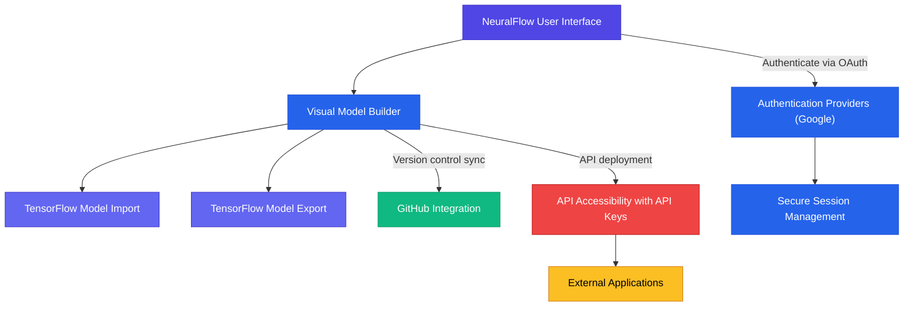

# Integration with Other Systems

Discover how NeuralFlow seamlessly connects to external machine learning platforms, authentication providers, and data ecosystems. This page outlines current and planned integrations—including import/export with TensorFlow, authentication mechanisms, and API accessibility—unlocking greater flexibility and extending your ML workflows beyond the NeuralFlow environment.

---

## Why Integration Matters

Machine learning projects rarely live in isolation. You need to bring together diverse datasets, leverage pre-built models, ensure secure user access, and deploy results into real-world applications effectively. NeuralFlow’s integration capabilities enable you to:

- Import and export models with industry-standard formats like TensorFlow to leverage existing work or continue development elsewhere.
- Authenticate users through external providers ensuring secure, hassle-free access.
- Connect your models with GitHub for version control and collaborative development.
- Access models programmatically via APIs to embed intelligent features into your applications.

This page guides you through these integration points, helping you extend NeuralFlow’s power to your broader ML and data ecosystem.

---

## Supported Integrations and Connections

### TensorFlow Model Import/Export

Import pretrained TensorFlow models into NeuralFlow or export your models back into the TensorFlow ecosystem for further development or deployment.

- **Use Case:** Quickly bring in existing TensorFlow architectures to build upon them visually without rewriting code.
- **How To:** Use the Import/Export UI sections or API endpoints tailored for model transfer.

Practical example imported from the insights within the platform:

```python
# Using Python SDK to fetch a model by ID with API key
import neuralflow as nf

NEURAL_FLOW_API_KEY = "your_api_key_here"

model = nf.getModel(
    id="model-uuid-string",
    api_key=NEURAL_FLOW_API_KEY
)
```

This snippet lets you programmatically retrieve models, showcasing how NeuralFlow extends beyond the UI.

---

### Authentication Providers

NeuralFlow currently integrates with external authentication providers like Google to simplify user login and session management.

- **Benefit:** Secure and streamlined access prevents manual account setup, accelerating team onboarding.
- **Example:** The login page leverages NextAuth for Google sign-in, letting users enter with a single click.

```tsx
// Login button triggers Google authentication
<Button onClick={() => signIn("google")}>Login with Google</Button>
```

This approach ensures that your access is both secure and convenient, supported by modern OAuth standards.

---

### GitHub Integration

Synchronize your model building process with GitHub repositories for version control and collaborative workflow management.

- **Feature:** Connect your GitHub account within NeuralFlow to push and pull model versions seamlessly.
- **User Benefit:** Track model history, review changes with your team, and maintain consistent backups.

This integration supports professional development practices crucial for projects scaling beyond prototyping.

---

### API Accessibility

Models created or imported can be exposed via generated API keys, enabling you to embed machine learning-powered predictions into your own applications.

- **How It Works:** Generate an API key within NeuralFlow and use it to authenticate calls to your deployed models.
- **Outcome:** Integrate AI features fluidly without managing the underlying infrastructure.

---

## Putting It All Together: Integration Flow



This flowchart captures the key integration touchpoints users interact with, outlining how authentication, model import/export, version control, and API deployment intertwine.

---

## Best Practices for Successful Integration

- **Use TensorFlow import/export thoughtfully:** Validate models post-import for compatibility. Use the visual builder to adjust and optimize.
- **Secure API keys:** Treat API keys like passwords. Regenerate or revoke them if you suspect compromise.
- **Leverage GitHub integration early:** Keep your model code and metadata synchronized for robust collaboration.
- **Adopt OAuth authentication:** Simplify access for teams while maintaining security.

---

## Troubleshooting Common Integration Issues

<AccordionGroup title="Common Integration Troubleshooting">
<Accordion title="Model Import Errors">
If you encounter errors importing TensorFlow models, verify that the model's layers and format are supported by NeuralFlow. Unsupported custom ops or layers might require conversion or modification outside NeuralFlow.
</Accordion>
<Accordion title="Authentication Failures">
Ensure your authentication provider (e.g., Google) is enabled and properly configured. Network issues or revoked permissions can block login. Clear cookies/cache or retry.
</Accordion>
<Accordion title="GitHub Sync Issues">
Check your repository permissions and OAuth scopes. Confirm the linked GitHub account has access to the repo. Review any error messages in the UI logs.
</Accordion>
<Accordion title="API Key Access Denied">
Validate that your API key is current and linked to the model. Confirm that your request format matches the API specification. Regenerate keys if needed.
</Accordion>
</AccordionGroup>

---

## Next Steps

- Explore [Build Your First Model (No Code)](/guides/core-workflows/first-model) to see how to start with NeuralFlow’s visual model building.
- Visit [Importing and Using Pretrained TensorFlow Models](/guides/core-workflows/import-model) for detailed guidance on TensorFlow integration.
- Review [Session Management and GitHub Integration](/overview/features-integration/feature-snapshot) for deeper insight into collaborative workflows.

Harness the power of NeuralFlow’s integrations to accelerate your machine learning projects—from model conception to deployment—seamlessly and securely.

---